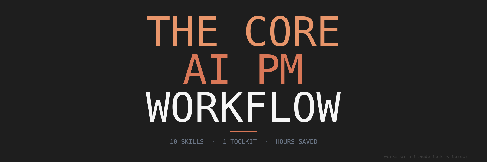

<div align="center">
  
</div>

<br/>

<h3 align="center">Stop writing docs from scratch. Stop forgetting what's on your plate.<br/>Stop spending 2 hours on a deck that should take 20 minutes.</h3>

This is a toolkit of **10 AI-powered skills** built by a PM, for PMs. Clone this repo, and your AI assistant (Claude Code or Cursor) becomes a PM productivity machine — writing docs, reviewing strategy, researching competitors, building presentations, and tracking your work across GitHub.

**These aren't prompts. They're workflows.** Each skill is a multi-step process that knows how to gather context, ask the right questions, and produce real artifacts you can ship.

---

## What You Get

| # | Skill | What it does | Time saved |
|---|-------|-------------|------------|
| 1 | **Calendar** | Pull today's meetings, prep for what's next | 5 min/day |
| 2 | **Google Docs** | Read, write, and sync docs without leaving your terminal | 10 min/doc |
| 3 | **Deep Dive** | Research any GitHub repo → polished HTML reference doc | 2-4 hours |
| 4 | **Competitor Research** | Structured competitive analysis from web + GitHub | 3-6 hours |
| 5 | **Doc Writer** | Write any PM doc — one-pagers, PRFAQs, PRDs, epics (7 formats) | 1-3 hours |
| 6 | **Doc Reviewer** | Get CTO or GM-level feedback on your draft before the meeting | 30-60 min |
| 7 | **HTML Reference Page** | Generate polished, self-contained stats/reference pages | 1-2 hours |
| 8 | **Presentation** | Build a slide deck from scratch — HTML, no PowerPoint needed | 1-3 hours |
| 9 | **Morning Standup** | Daily metric check-in with configurable alerts | 15 min/day |
| 10 | **My Initiatives** | Track your GitHub issues and sync them to your task list | 10 min/day |

---

## Quick Start

### Prerequisites

- [Claude Code](https://docs.anthropic.com/en/docs/claude-code/overview) or [Cursor](https://cursor.com)
- [GitHub CLI](https://cli.github.com/) (`gh`) — installed and authenticated
- Python 3.9+ (for calendar and Google Docs skills)

### Install

```bash
# Clone the repo
git clone https://github.com/YOUR_USERNAME/core-ai-pm-workflow.git
cd core-ai-pm-workflow

# Open in Claude Code
claude

# Or open in Cursor
cursor .
```

Then say: **"Start the journey"** — and the AI walks you through setup and your first skill.

### Or jump straight in:

```
"Write a one-pager for [your feature idea]"
"Deep dive into the authentication system in [org/repo]"
"Create a presentation about [your initiative]"
"Review this doc as a CTO"
```

---

## The Journey

New to this? Follow the guided walkthrough. Each step builds on the last and produces a real artifact you keep.

| Step | What you do | What you get |
|------|-------------|-------------|
| [01 - Setup](journey/01-setup.md) | Clone, configure, connect Google OAuth | Working toolkit |
| [02 - Read](journey/02-read.md) | Pull in context (Calendar, Docs, Slides) | Your day's context, imported |
| [03 - Research](journey/03-research.md) | Deep-dive a repo, research a competitor | HTML reference doc + competitor profile |
| [04 - Write](journey/04-write.md) | Generate a doc (one-pager, PRD, PRFAQ) | Draft ready for review |
| [05 - Review](journey/05-review.md) | Get AI feedback on your draft | CTO/GM-reviewed doc |
| [06 - Present](journey/06-present.md) | Turn findings into a deck or HTML page | Presentation-ready artifact |
| [07 - Ship](journey/07-ship.md) | Push to Google Docs, share with stakeholders | Shared, formatted doc |
| [08 - Customize](journey/08-customize.md) | Add your own data sources, build your standup | Personalized workflow |

---

## How It Works

Each skill is a `SKILL.md` file — a structured prompt that tells your AI assistant exactly how to handle a task. When you say "write a one-pager," the AI reads `skills/doc-writer/SKILL.md` and follows a multi-step process:

1. **Understand** what you're asking for
2. **Gather context** from your codebase, docs, or data
3. **Produce the artifact** using proven templates and formats
4. **Iterate** based on your feedback

You don't need to know how the skills work. Just describe what you want in natural language.

### Works with Claude Code AND Cursor

The skills system is compatible with both tools. The setup guide covers configuration for each.

---

## Repo Structure

```
core-ai-pm-workflow/
├── README.md              ← You are here
├── CLAUDE.md              ← AI assistant configuration
├── skills/                ← The 10 skills
│   ├── calendar/          ← Google Calendar reader
│   ├── gdocs-share/       ← Google Docs read/write/sync
│   ├── deep-dive/         ← GitHub repo researcher
│   ├── competitor-research/ ← Competitive analysis
│   ├── doc-writer/        ← Document writer (7 formats)
│   ├── doc-reviewer/      ← Document reviewer (CTO/GM personas)
│   ├── html-reference-page/ ← HTML page generator
│   ├── presentation/      ← Slide deck builder
│   ├── morning-standup/   ← Daily metric standup
│   └── my-initiatives/    ← GitHub issue tracker
├── journey/               ← Guided walkthrough (8 steps)
├── templates/             ← Document format templates
├── assets/                ← Branding assets (banner, etc.)
├── docs/                  ← HTML documentation pages
├── output/                ← Generated artifacts (gitignored, created on first use)
├── tasks/                 ← Your task tracking
└── data/                  ← Persistent data and configs (gitignored, created on first use)
```

---

## Skill Highlights

### Doc Writer — 7 PM Document Formats

Not just "write me a doc." The doc writer understands PM document formats and **infers the right one** from your request:

- **Concept One-Pager** — New ideas, vision pieces (narrative format)
- **Problem/Solution One-Pager** — Feature enhancements (structured format)
- **Decision One-Pager** — Choosing between options (opinionated format)
- **PRFAQ** — Big bets (press release + FAQ format)
- **PRD / Structured Epic** — Full specs with work streams
- **Vision Epic** — Direction-setting for new initiatives
- **GitHub Issue** — Publish directly to any repo

### Doc Reviewer — CTO and GM Personas

Get feedback from the perspective of:
- **CTO** — Feature fit, simplicity, green field fallacy, phasing risk
- **GM (Concept/Problem-Solution)** — Phase clarity (Explore/Expand/Extract), problem gravity, adoption mechanics
- **GM (Decision)** — Decision clarity, ownership, reversibility, opportunity cost

Based on Kent Beck's [3X framework](https://medium.com/@kentbeck_7670/fast-slow-in-3x-explore-expand-extract-6d4c94a7539) — not generic AI feedback.

### Morning Standup — Your Metrics, Your Way

Configure metrics that matter to you. The skill runs your queries, evaluates thresholds, and reports what needs attention:

```
🔴 Needs Attention: Conversion rate dropped to 18% (threshold: 25%)
🎉 Milestone: Feature adoption hit 6,127 accounts (target: 6,000)
🟢 All Clear: Health score 99.4%, DAU normal range
```

Works with any SQL-compatible data source — BigQuery, PostgreSQL, Snowflake, or anything with a CLI.

---

## FAQ

**Do I need to know how to code?**
No. You need to be comfortable running commands in a terminal (or letting Claude Code / Cursor do it for you). The journey walkthrough assumes zero coding experience.

**Does this work with my company's data?**
The core skills (doc writing, reviewing, presentations, research) work out of the box. Data-dependent skills (morning standup, initiative tracking) are configurable — you bring your own queries, repos, and data sources.

**Is this a course or a tool?**
It's a tool with a guided onboarding journey. You can skip the journey and start using skills immediately, or follow it step by step to learn the workflow.

**Can I add my own skills?**
Yes. Create a new directory in `skills/` with a `SKILL.md` file following the same format. The AI will pick it up automatically.

**What about security?**
- Google OAuth tokens are stored locally and never committed (gitignored)
- No data leaves your machine except through the APIs you explicitly configure
- All skills follow security best practices (HTML sanitization, no code execution from fetched content)

---

## Contributing

Found a bug? Have an idea for a new skill? [Open an issue](https://github.com/davethegut/core-ai-pm-workflow/issues) or submit a PR.

---

## License

MIT License. See [LICENSE](LICENSE) for details.

---

Built by a PM who got tired of doing the same things manually every week.
