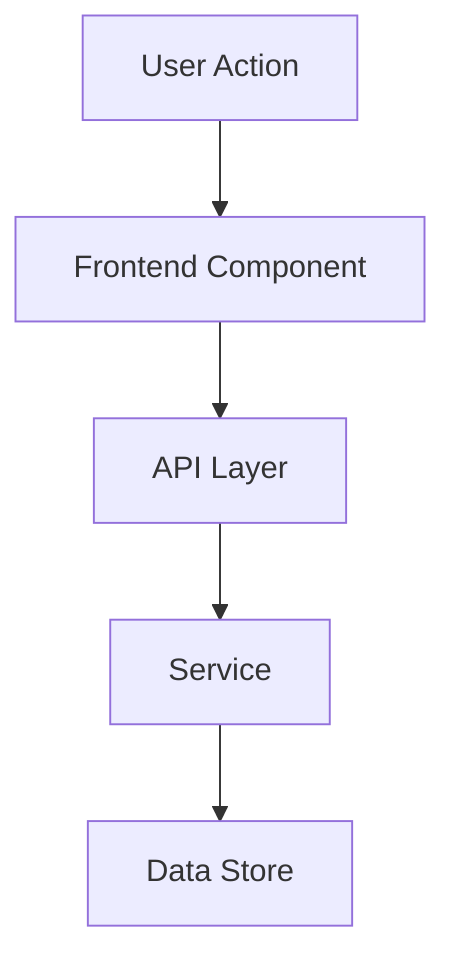

# [EPIC TITLE]

> **Status:** [Draft | In Progress | Complete]
> **Author:** [NAME]
> **Date:** [YYYY-MM-DD]
> **Epic Link:** [URL]
> **Target Release:** [VERSION / DATE]

---

## Background

[2-3 paragraphs providing context. Describe the current state of the product area, relevant history, and why this work is being considered now. Link to prior art, research, or related initiatives.]

---

## User Story / Problem Statement

**As a** [persona/role],
**I want to** [action/capability],
**so that** [outcome/benefit].

### Problem Details

[Expand on the problem. Include data where available — support ticket volume, user research findings, funnel drop-off rates, competitive gaps. Quantify the impact of not solving this.]

---

## The Solution

[Describe the proposed solution at a high level. Focus on what changes from the user's perspective.]

### UX: Before

[Describe or screenshot the current experience. What does the user see and do today? Where does friction occur?]

### UX: After

[Describe or screenshot the proposed experience. What will the user see and do after this ships? Highlight the key improvements.]

---

## Architecture

[Describe the technical approach. Include a diagram showing the key components and data flow.]

[Add notes explaining non-obvious architectural decisions, new services, or changes to existing systems.]

---

## Goals & Non-Goals

### Goals

- [Goal 1 — what this epic WILL achieve]
- [Goal 2]
- [Goal 3]

### Non-Goals

- [Non-goal 1 — what this epic will NOT address, and why]
- [Non-goal 2]
- [Non-goal 3]

---

## Work Streams

### Work Stream 1: [NAME]

- [ ] [Task 1.1]
- [ ] [Task 1.2]
- [ ] [Task 1.3]

### Work Stream 2: [NAME]

- [ ] [Task 2.1]
- [ ] [Task 2.2]
- [ ] [Task 2.3]

### Work Stream 3: [NAME]

- [ ] [Task 3.1]
- [ ] [Task 3.2]

---

## Child Issues

| Issue | Description | Deliverable |
|-------|-------------|-------------|
| [ISSUE-001] | [Brief description of the work] | [What ships when this is done] |
| [ISSUE-002] | [Brief description of the work] | [What ships when this is done] |
| [ISSUE-003] | [Brief description of the work] | [What ships when this is done] |
| [ISSUE-004] | [Brief description of the work] | [What ships when this is done] |

---

## Key Design Decisions

| Decision | Rationale | Tradeoffs |
|----------|-----------|-----------|
| [Decision 1 — e.g., "Use event-driven architecture"] | [Why this was chosen] | [What we give up or risk] |
| [Decision 2] | [Why this was chosen] | [What we give up or risk] |
| [Decision 3] | [Why this was chosen] | [What we give up or risk] |

---

## Success Criteria

### Metrics

| Metric | Current | Target | Timeline |
|--------|---------|--------|----------|
| [Metric 1 — e.g., "Task completion rate"] | [Baseline] | [Target value] | [By when] |
| [Metric 2] | [Baseline] | [Target value] | [By when] |
| [Metric 3] | [Baseline] | [Target value] | [By when] |

### Acceptance Checklist

- [ ] [Criterion 1 — e.g., "User can complete core workflow without errors"]
- [ ] [Criterion 2 — e.g., "P95 latency under 500ms"]
- [ ] [Criterion 3 — e.g., "Feature passes accessibility audit"]
- [ ] [Criterion 4 — e.g., "Documentation published"]

---

## Technical Requirements

- **Performance:** [Latency, throughput, or scalability requirements]
- **Security:** [Authentication, authorization, data handling requirements]
- **Compatibility:** [Browser, API, or backward-compatibility requirements]
- **Observability:** [Logging, monitoring, alerting requirements]
- **Testing:** [Unit, integration, E2E coverage expectations]

---

## Related Epics

- [EPIC-XXX] — [Title and brief description of relationship]
- [EPIC-YYY] — [Title and brief description of relationship]

---

## Stakeholders

| Role | Name | Responsibility |
|------|------|----------------|
| Product Manager | [NAME] | Requirements, prioritization, acceptance |
| Tech Lead | [NAME] | Architecture, technical decisions |
| Engineering | [NAME(S)] | Implementation |
| Design | [NAME] | UX design, user research |
| QA | [NAME] | Test planning, validation |
| [Other] | [NAME] | [Responsibility] |
